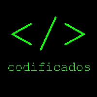
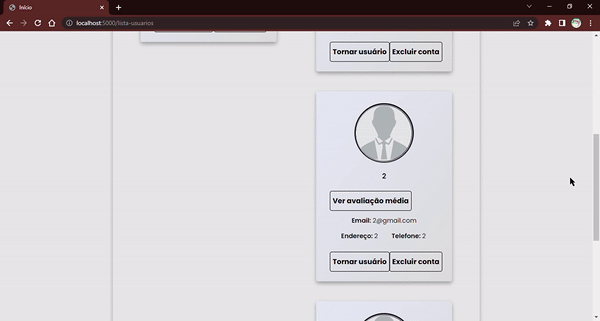

# Portfólio - Gabriel da Cunha de Macedo

Portfólio sobre os projetos semestrais (APIs) desenvolvidos no curso de Desenvolvimento de Software Multiplataforma, do apresentado na disciplina de Gestão Ágil de Projetos de Software

## Sobre mim

Meu nome é Gabriel da Cunha de Macedo, tenho 18 anos, técnico em desenvolvimento de sistemas pela ETEC Profª Ilza Nascimento Pintus, e atualmente cursando 3º Semestre de Desenvolvimento de Software Multiplataforma na FATEC Profº Jessen Vidal.

Já participei de atividades extracurriculares como a Olimpíada Brasileira de Informática (OBI), maratonas de programações e hackathons, já participei de competições de robótica da FIRST atuando como programador e mentor da equipe de programação, e atualmente sou estagiário na empresa de desenvolvimento de software <a href="https://https://midall.com.br/">Midall</a>.

## Projetos

## 1º Semestre - 2022.1

<b>Grupo: </b>Codificados
  

  
<b>Cliente:</b> Cliente interno da FATEC, professor Fabrício Galende 
 
<b>Tema:</b> Sistema de Gestão de Serviços de Tecnologia da Informação

### <b> Problema apresentado: </b>

O cliente interno da FATEC, professor Fabrício Galende, apresentou a necessidade de um sistema que controlasse a prestação de serviços de TI, tanto sob o ponto de vista do cliente como do executor. O sistema deveria permitir que os usuários comuns do sistema pudessem abrir solicitações de serviços de TI e os técnicos pudessem responder aos chamados.

### <b> Solução proposta: </b>

A solução proposta foi o desenvolvimento de um sistema web que permitisse a abertura de solicitações de serviços de TI e a avaliação dos serviços prestados pelos técnicos. O sistema foi desenvolvido utilizando a linguagem de programação Python, o framework web Flask e o banco de dados MySQL.

Imagem da página de relatórios do administrador:
 

 

### <b>Tecnologias utilizadas</b>

<ul>
<li><b>Figma: </b> Prototipação das telas</li>
<li><b>Python: </b> Linguagem de programação utilizada</li>
<li><b>Flask: </b> Framework web utilizado</li>
<li><b>MySQL: </b> Banco de dados utilizado</li>
<li><b>Trello: </b> Gerenciamento de tarefas</li>
</ul>

### <b>Contribuições pessoais</b>

Desempenhei o papel de Product Owner, sendo responsável por gerenciar o backlog do projeto e a das sprints, dividi as tasks entre os membros do grupo baseado na prioridade e na dificuldade de cada uma, e também ajudei os membros do grupo com as tasks que eles tinham dificuldade como na criação de rotas e a conexão com o banco de dados. Realizei as documentações do projeto como o `README.md`, backlog, modelagem do banco de dados.
### <b> Hard Skills </b>

<ul>
<li><b>Python: </b> Aprendi manipulação de strings, conectar com o banco de dados, manipulação de strings e melhorei minha lógica de programação</li>
<li><b>Flask: </b> Aprendi a criar rotas, conectar com o banco de dados e manipular dados</li>
<li><b>MySQL: </b> Aprendi a criar tabelas, inserir dados, fazer consultas e manipular dados</li>
<li><b>Trello: </b> Aprendi a gerenciar tarefas</li>
<li><b>Git: </b> Aprendi a criar repositórios, clonar repositórios, criar branches, fazer commits e pushs</li>
<li><b>Documentação: </b> Aprendi a criar documentação de projetos</li>
<li><b>Metodos ágeis: </b> Aprendi a trabalhar com metodologias ágeis</li>
</ul>

### <b> Soft Skills </b>

<ul>
<li><b>Trabalho em equipe: </b> Aprendi a trabalhar em equipe, a ouvir as ideias dos outros e a respeitar as opiniões dos outros</li>
<li><b>Comunicação: </b> Aprendi a me comunicar melhor com os outros e com o cliente</li>
<li><b>Proatividade: </b> Aprendi a ser mais proativo e a buscar soluções para os problemas</li>
<li><b>Organização: </b> Aprendi a me organizar melhor e a organizar as tarefas do grupo</li>
</ul>

### 2º Semestre

### 3º Semestre